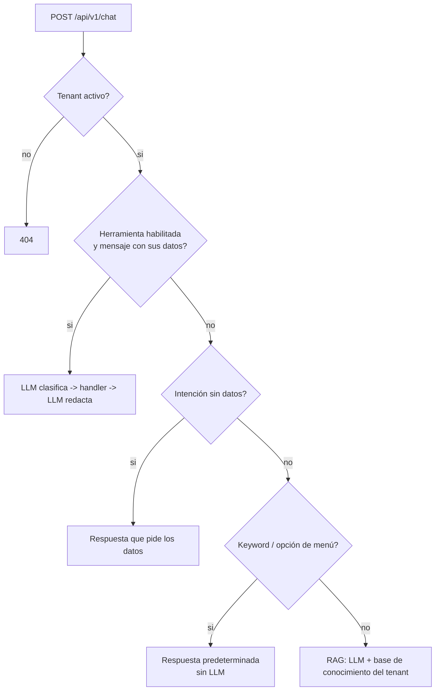

# Multitenant RAG Chatbot

[](https://github.com/santiagovalenzuelalopez-gif/multitenant-rag-chatbot/actions/workflows/ci.yml)


Microservicio de chatbot **multitenant** para atención al usuario. Con un `{tenant_id, question}` resuelve la configuración aislada de cada organización y responde por el camino más barato y determinista posible: **herramientas → respuestas predeterminadas → RAG con LLM**.

Pensado para correr en **Cloud Run** con Gemini File Search y Firestore, pero **funciona completo sin credenciales ni red** gracias a backends intercambiables (modo demo).

## Por qué este diseño

| Problema | Decisión |
|---|---|
| Muchas organizaciones, un solo servicio | Cada tenant es un documento de configuración (identidad, protocolo, respuestas, capacidades, base de conocimiento). Un `tenant_id` inválido o inactivo devuelve 404: **nunca** se cae a otro contexto. |
| El LLM es lento y caro para preguntas de menú | **Fast path** por palabra clave (sin LLM) con límite de palabras extra, para que una pregunta elaborada no sea interceptada por el menú. |
| Datos en vivo (estado de un ticket) | **Function calling con allow-list**: la herramienta solo existe si el tenant la habilita (*fail-closed*), se detecta por la **forma** del mensaje y los argumentos se validan en el handler, no en el modelo. |
| Respuestas contradictorias | Flujo de **dos turnos**: clasificación sin RAG → consulta → respuesta final con el resultado inyectado. |
| Probar sin claves | Interfaces `TenantRepository` y `LLMClient` con implementaciones de demo (`filesystem` + `mock`). |

Más detalle y diagramas en [docs/ARQUITECTURA.md](docs/ARQUITECTURA.md).

## Flujo de una consulta



## Ejecutar (modo demo)

```bash
python -m venv .venv && source .venv/bin/activate   # Windows: .venv\Scripts\activate
pip install -r requirements-dev.txt
uvicorn app.main:app --reload
```

o con Docker: `docker compose up --build`.

Dos tenants ficticios vienen en [`data/tenants/`](data/tenants): `demo-soporte` (con la herramienta de tickets) y `demo-tienda`.

```bash
# Fast path (sin LLM)
curl -s localhost:8000/api/v1/chat -H 'content-type: application/json' \
  -d '{"tenant_id":"demo-soporte","question":"¿Cuál es el horario de atención?"}'

# Herramienta: estado de un ticket en vivo
curl -s localhost:8000/api/v1/chat -H 'content-type: application/json' \
  -d '{"tenant_id":"demo-soporte","question":"Estado de mi ticket TCK-100001 código A1B2C3"}'

# RAG sobre la base de conocimiento del tenant
curl -s localhost:8000/api/v1/chat -H 'content-type: application/json' \
  -d '{"tenant_id":"demo-tienda","question":"¿Cuántos días tardan los envíos nacionales?"}'
```

## Endpoints

| Método | Ruta | Descripción |
|---|---|---|
| `POST` | `/api/v1/chat` | Responde una pregunta de un tenant. Devuelve `{answer, source}`. |
| `GET` | `/health` | Sonda de salud. |
| `GET` | `/version` | Servicio, versión y ambiente. |

`source` indica quién resolvió: `predetermined`, `tool:<nombre>`, `<herramienta>_intent`, `knowledge_base`, `tool_timeout`.

## Modo producción (GCP)

```bash
pip install -r requirements-gcp.txt
export TENANT_BACKEND=firestore LLM_BACKEND=gemini GCP_PROJECT=<proyecto> GEMINI_API_KEY=<desde Secret Manager>
```

- **Tenants**: colección Firestore `tenants/{tenant_id}` con los mismos campos que los archivos de demo (`active`, `identity`, `protocol`, `predetermined_answers`, `capabilities`, `file_search_store_name`).
- **RAG**: el LLM adjunta el *File Search Store* del tenant como herramienta de Gemini.
- **Imagen**: `docker build --build-arg REQUIREMENTS=requirements-gcp.txt .`

## Variables de entorno

Ver [`.env.example`](.env.example). Principales:

| Variable | Default | Descripción |
|---|---|---|
| `TENANT_BACKEND` | `filesystem` | `filesystem` o `firestore` |
| `LLM_BACKEND` | `mock` | `mock` o `gemini` |
| `TENANT_CACHE_TTL_SECONDS` | `90` | TTL de la caché de tenants en memoria |
| `GEMINI_API_KEY` | – | Solo con `LLM_BACKEND=gemini`; usar gestor de secretos |
| `TOOL_LOOP_BUDGET_SECONDS` | `20` | Presupuesto duro del camino con herramienta |
| `LOG_LEVEL` | `INFO` | Nivel de logs |

## Observabilidad

Logs JSON a stdout compatibles con Cloud Logging. Un middleware propaga `X-Correlation-ID` y extrae el contexto de traza de `X-Cloud-Trace-Context` o `traceparent` (W3C), de modo que cada línea de log de un request comparte el mismo `trace` y `correlation_id`.

## Tests

```bash
pytest -q          # 19 tests, sin red ni credenciales
ruff check .
```

Cubren aislamiento entre tenants, fast path (menú, límite de palabras, coincidencia por palabra completa), RAG, herramienta (incluido el caso multi-turno y que un código incorrecto no revele si el ticket existe), fail-closed y rechazo de *path traversal*.

## Estructura

```
app/
  core/        config, logging JSON, middleware de correlación
  models/      schemas de la API
  routers/     /chat y /health
  services/
    tenants.py    repositorios (filesystem | Firestore) + caché TTL
    fast_path.py  respuestas predeterminadas
    tools.py      registro de herramientas con allow-list
    llm.py        Gemini | simulado, prompts por tenant
data/tenants/  tenants de demo
tests/
```

## Licencia

MIT
