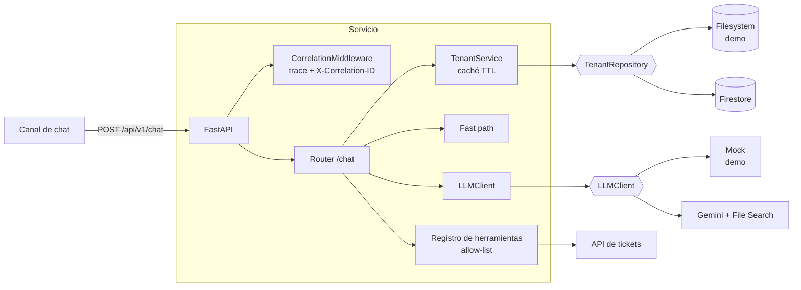
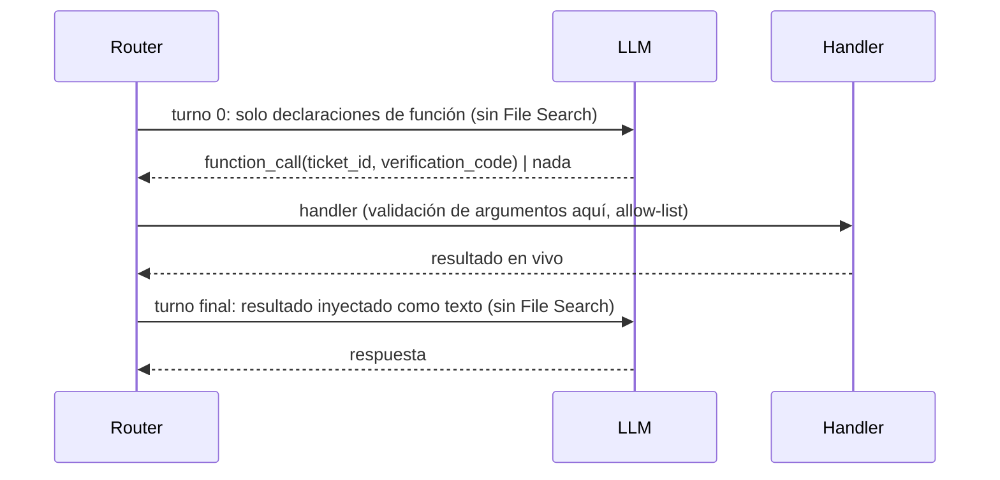

# Arquitectura

## Componentes

`TenantRepository` y `LLMClient` son `Protocol`s: el router no sabe qué implementación hay detrás, por eso el pipeline completo se prueba sin red.

## ADR-1: orden de resolución

**Contexto.** Cada llamada al LLM cuesta latencia y dinero, y una respuesta de RAG no es determinista.

**Decisión.** Resolver de lo más determinista a lo más caro: herramienta → intención sin datos → fast path → RAG.

**Consecuencias.** Las preguntas de menú no gastan LLM; un mensaje con los datos de una herramienta *salta* el fast path (si no, una keyword como "consultar ticket" devolvería siempre el mismo instructivo).

## ADR-2: herramientas por forma, no por keyword

El desvío al camino de herramienta se dispara por la **forma** de los datos (un `TCK-123456`), no por palabras. Así "3", "menú" o una pregunta normal nunca lo activan. En conversaciones multi-turno (ticket en un mensaje, código en el siguiente) se revisa también el historial.

La intención sin datos ("quiero consultar mi ticket") se trata aparte con una respuesta predeterminada que pide los datos: el RAG no garantiza mencionar esa opción.

## ADR-3: function calling en dos turnos

File Search y function calling **no se pueden combinar** en una misma request de Gemini. El flujo es:

Si el modelo no pide herramienta (faltan datos), el router sigue con el flujo normal. Todo el camino tiene un presupuesto (`TOOL_LOOP_BUDGET_SECONDS`) por debajo del deadline del gateway: ante un timeout se responde con un mensaje propio en vez de un 504 opaco.

## ADR-4: seguridad por defecto

- **Fail-closed**: sin `capabilities.tools.<nombre> == true` en el tenant, la herramienta no se ofrece.
- **Sin enumeración**: ticket inexistente y código incorrecto devuelven la misma respuesta.
- **Aislamiento**: tenant inexistente/inactivo → 404; el `tenant_id` se valida con regex y el repositorio de archivos comprueba que la ruta resuelta quede dentro del directorio base.
- **Historial como dato**: el prompt indica al modelo que ignore instrucciones dentro del historial.
- **Secretos**: nunca en el repo; `GEMINI_API_KEY` se inyecta desde un gestor de secretos.

## ADR-5: no bloquear el event loop

El SDK de Gemini es síncrono. Cada llamada se ejecuta con `asyncio.to_thread`; sin eso, con un worker por instancia, una consulta lenta encolaría a todos los demás usuarios concurrentes.

## Despliegue sugerido (Cloud Run)

- 1 worker por instancia (Cloud Run escala por instancias), `min-instances=0`.
- Cuenta de servicio dedicada con permisos mínimos a Firestore.
- Logs JSON a stdout → Cloud Logging; trazas correlacionadas por `X-Cloud-Trace-Context`.
